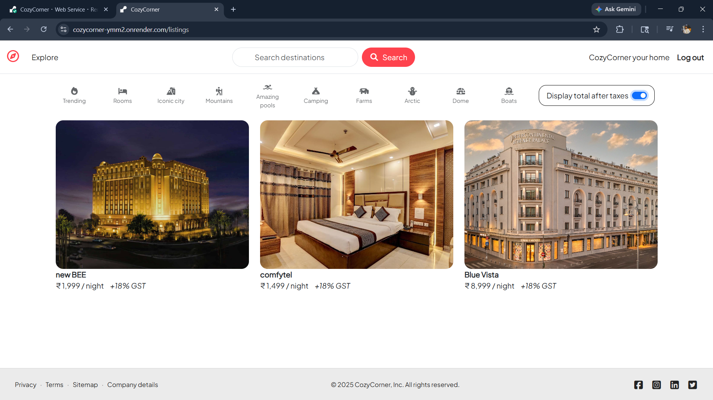
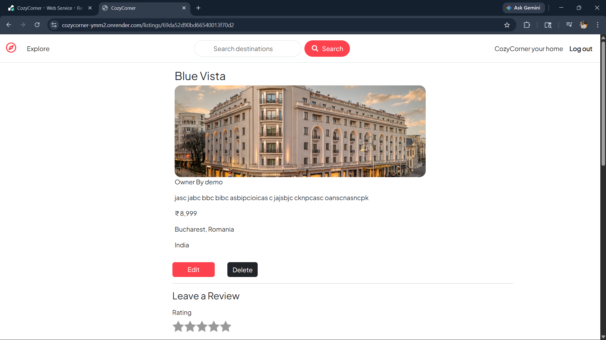
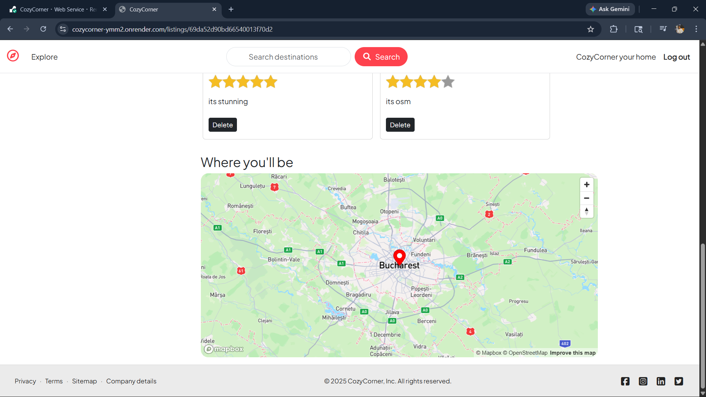
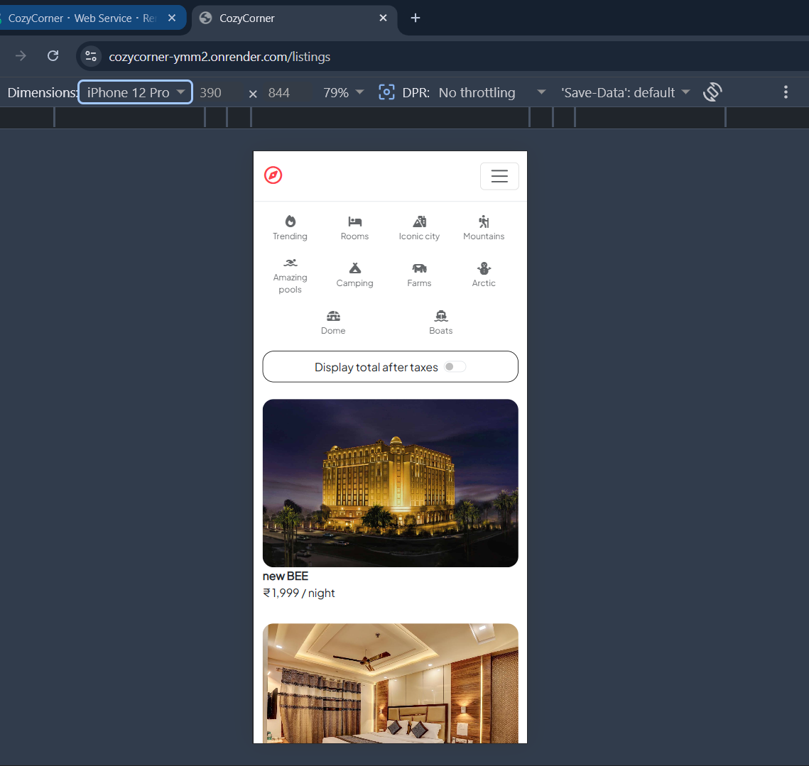
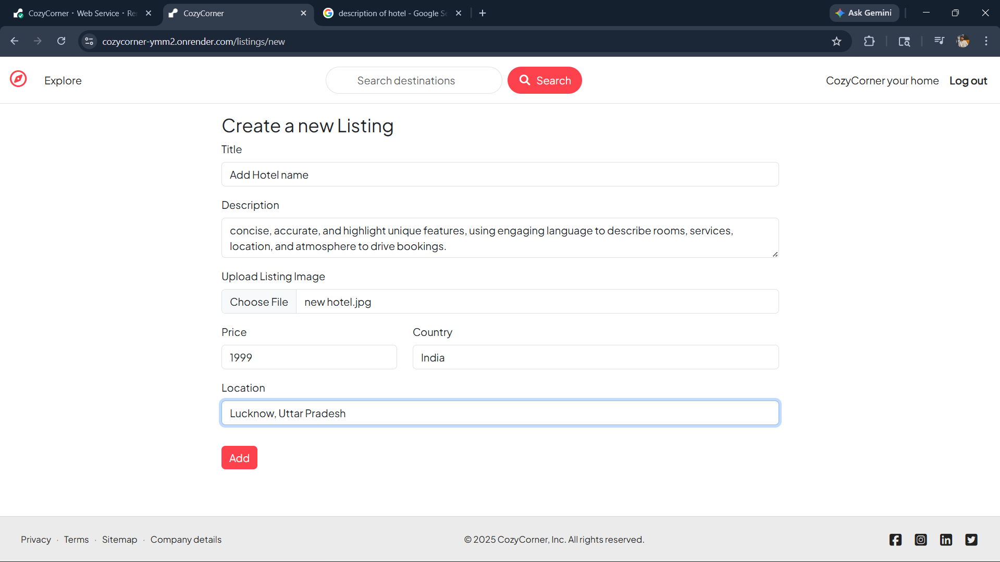
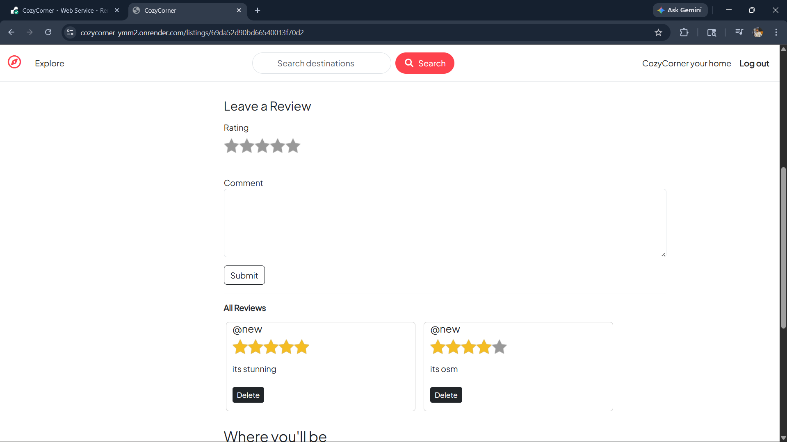

# 🏡 CozyCorner – Full Stack MERN Rental Platform

🚀 **CozyCorner** is a full-stack Airbnb-inspired rental platform that allows users to explore, create, and manage property listings with secure authentication, image uploads, interactive maps, and reviews.

🔗 **Live Demo:**  
https://cozycorner-ymm2.onrender.com/listings  

---

# ✨ About The Project

CozyCorner simulates a real-world rental platform similar to Airbnb.  
Users can browse listings, upload property images, view locations on maps, leave reviews, and manage their own listings securely.

This project focuses on building **scalable backend architecture**, integrating **third-party services**, and deploying a **production-ready application**.

---

# 🚀 Project Highlights

✔ User Authentication & Authorization  
✔ Full CRUD Operations for Listings  
✔ Image Uploads using Cloudinary  
✔ Map Integration with Geocoding  
✔ Reviews System with Validation  
✔ Search, Filters & Tax Toggle  
✔ Session Management & Flash Messages  
✔ MVC Architecture Implementation  
✔ Responsive UI using Bootstrap & Media Queries  
✔ Successfully Deployed on Render  

---

# 🛠 Tech Stack

## Frontend
- EJS
- Bootstrap
- HTML5
- CSS3
- JavaScript
- Media Queries

## Backend
- Node.js
- Express.js

## Database
- MongoDB Atlas
- Mongoose

## Services & Tools
- Cloudinary (Image Uploads)
- Mapbox (Maps & Geocoding)
- Passport.js (Authentication)
- Render (Deployment)
- Git & GitHub

---

# 📸 Screenshots

## 🏠 Homepage

---

## 📍 Listing Page

---

## 🗺 Map View

---

## 📱 Mobile Responsive View

---

## ➕ Add New Listing

---

## ⭐ Reviews Section

---

## 📂 Project Structure

    CozyCorner/
    │
    ├── models/
    ├── routes/
    ├── controllers/
    ├── views/
    ├── public/
    ├── utils/
    │
    ├── app.js
    ├── cloudConfig.js
    ├── middleware.js
    ├── schema.js
    ├── package.json

---

# ⚙ Installation & Setup

Follow these steps to run the project locally.

## 1️⃣ Install Dependencies

Run the following command:

npm install

---

## 2️⃣ Create Environment Variables

Create a `.env` file in the root directory and add the following variables:

MONGO_URL=your_mongodb_connection  
CLOUD_NAME=your_cloudinary_name  
CLOUD_API_KEY=your_cloudinary_key  
CLOUD_API_SECRET=your_cloudinary_secret  
MAPBOX_TOKEN=your_mapbox_token  
SESSION_SECRET=your_secret  

---

## 3️⃣ Run the Project

Start the server:

npm start

---

## 4️⃣ Open in Browser

Visit:

http://localhost:3000  ( your localhost port )

---

# 🌍 Deployment

The application is deployed using the following services:

• Render — Backend Hosting  
• MongoDB Atlas — Database  
• Cloudinary — Image Storage  
• Mapbox — Location Services  

🔗 Live Project:

https://cozycorner-ymm2.onrender.com/listings
